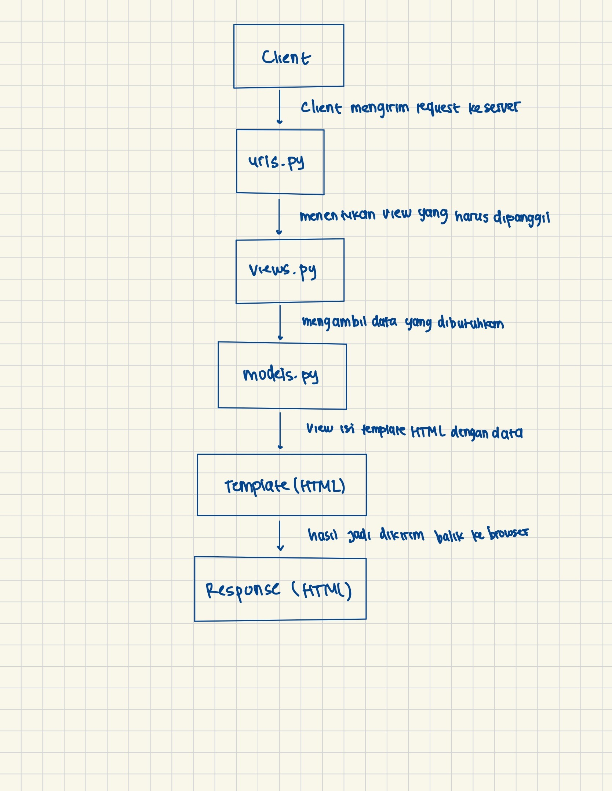

# -----Tugas 2------ #
1.  
    Langkah awal saya dalam mengerjakan Tugas 2 PBP ini adalah menentukan nama project, dan akhirnya saya memilih League Locker. Setelah itu, saya membuat repositori baru di GitHub lalu melakukan clone ke folder lokal. Dari folder hasil clone tersebut, saya membuka command prompt untuk membuat direktori sekaligus mengaktifkan virtual environment. Perintah yang saya gunakan adalah python -m venv env untuk membuat env, lalu env\Scripts\activate untuk mengaktifkannya.

    Pada tahap konfigurasi environment, inisiasi schema saya ubah menjadi "tugas_individu". Setelah itu selesai, saya langsung melanjutkan dengan menjalankan server menggunakan perintah python manage.py migrate dan python manage.py runserver.

    Begitu server berhasil dijalankan, saya mengunggah project versi “setengah jadi” ini ke GitHub. Langkah pertama adalah menghubungkan repositori lokal dengan repositori GitHub yang sudah dibuat sebelumnya. Setelah itu, saya membuat branch baru dengan nama master. Lalu, saya melakukan git add, git commit, dan git push agar project tersebut berhasil terunggah ke GitHub. Selain itu, saya juga menambahkan file .gitignore supaya file-file yang tidak diperlukan tidak ikut terunggah.

    Pada langkah berikutnya, saya mulai masuk ke konfigurasi Django dan mengimplementasikan Model-View-Template (MVT) sebelum menambahkan project ke Pacil Web Service (PWS). Pertama-tama, saya memastikan virtual environment di folder league-locker sudah aktif. Setelah itu, saya membuat aplikasi baru bernama main dengan menjalankan perintah python manage.py startapp main.

    Setelah aplikasi main berhasil dibuat, saya membuat template sederhana berupa file HTML untuk menampilkan informasi awal project League Locker saya. Isinya hanya nama project, nama saya, dan kelas, supaya saya bisa memastikan struktur MVT sudah berjalan dengan baik.

    Berikutnya, saya mengubah file models.py di aplikasi main sesuai ketentuan soal. Model yang saya buat berisi atribut name, price, description, thumbnail, category, dan is_featured. Setelah model selesai, saya menjalankan migrasi agar database menyesuaikan dengan model tersebut.

    Langkah setelah itu adalah melakukan modifikasi template agar data lebih sesuai, serta menambahkan routing di urls.py supaya halaman bisa diakses dengan benar lewat browser.

    Setelah semua bagian dasar MVT selesai, saya baru lanjut menambahkan project ke Pacil Web Service (PWS). Di tahap ini, saya membuat project baru dan menyimpan project credentials yang diperlukan. Lalu, saya menambahkan konfigurasi environs dan menyesuaikannya dengan environment di file .env.prod.

    Selanjutnya, saya memperbarui file settings.py dengan menambahkan URL deployment ke bagian ALLOWED_HOSTS agar project bisa diakses melalui server PWS. Terakhir, saya melakukan git push ke PWS untuk deployment, sekaligus git push ke GitHub supaya semua perubahan terbaru juga tersimpan di repositori.

2. Berikut merupakan bagan request client ke web apliksi berbasis Django.

3. settings.py seperti "pusat pengaturan" yang ada di project Django. File ini menampung konfigurasi penting, speerti database, daftar aplikasi yang aktif, middleware. Jadi kalau kita mau ganti/nambah/atur kayak allowed hosts gitu bisa di file ini.

4. Cara kerja migrasi database itu ada dua. Pertama dengan command "python manage.py makemigrations", disini Django akan mencatat perubahan model yang telah kita buat. Kedua dengan command "python manage.py migrate", pada command ini Django akan menjalankan perubahan tersebut ke database. Jadi migrasi ini fungsinya untuk sinkronisasi antara database dan model yang sudah kita buat di kode.

5. Karena pada Django sudah terdapat fitur-fitur penting kayak login user, admin panel, database, hingga routing. Jadi pemula kayak kita gaperlu pusing-pusing cari komponen tambahan lagi. Selain itu, Django juga mudah dipahami alurnya dan memiliki dokumentasi yang besar, ini dapat membantu para pemula belajar ngoding dengan rapi dan teratur.

6. Terima kasih banyak untuk tim Asdos terutama kak Clarence dan kak Isa yang membantu saya saat tidak dapat membuat aplikasi main pada tutorial 1. 

# -----Tugas 3------ #
1. Data delivery diperlukan agar server dan client dapat saling bertukar informasi, sehingga platform dapat berjalan dengan lancar dan dapat menampilkan data ke pengguna.

2. Mengapa json lebih banyak dipakai sekarang dibanding xml? karena xml ini secara usia lebih tua, lalu memiliki struktur yang tidak mudah, memiliki banyak tag, dan ukurannya yang lebih besar jika dibandingkan dengan json yang lebih simpel, lebih ringan, mudah dibaca manusia dan mesin. Jadi, json lebih populer karena dia lebih praktis dan parsingnya lebih cepat daripada xml.

3. Method is_valid() dipakai untuk mengecek apakah data yang diisi oleh user di form sudah sesuai aturan atau belum. Misal, field harga harus diisi oleh angka atau field tumbnail harus diisi dengan url gambarnya. Kalau is_valid() hasilnya True, berarti data aman untuk disimpan ke database. Kalau tidak, akan muncul error.

4. csrf_token dipakai untuk keamanan form. Dia bakal mencegah serangan yang namanya CSRF (Cross-Site Request Forgery), yaitu kondisi ketika penyerang bikin user tanpa sadar mengirim request berbahaya ke server (misal transfer uang atau ubah password). Kalau tidak pakai csrf_token, penyerang bisa bikin form palsu di website lain, lalu memaksa user login kita untuk submit data ke server kita. Akibatnya, sistem bisa dipakai tanpa izin user yang asli.

5. Langkah awal yang saya lakukan adalah dengan memastikan struktur direktori saya sudah sesuai dengan yang terdapat di tutorial 2. Lalu, saya mengimplementasikan skeleton sebagai kerangka view yang berfungsi untuk memastikan adanya konsistensi dalam desain situs web kita serta memperkecil kemungkinan terjadinya redundansi kode. Lalu, saya lanjut membuat form input data dan menampilkan data dari project saya (league locker) pada HTML dengan membuat struktur forms, membuat beberapa fungsi baru di views.py, lalu routing url di urls.py, serta menambahkan file HTML dengan menyesuaikan beberapa variabel berdasarkan field saya yang terdapat pada models.

Selanjutnya saya melalukan pengembalian data dalam bentuk xml dan json dengan menambahkan beberapa function seperti show_xml dan show_json, tidak lupa juga untuk menambahkan path url di dalam file urls.py. Selain itu, saya juga melakukan pengembalian data berdasarkan ID dalam bentuk xml dan json. Anyway, di dalam field models project saya ini belum terdapat id dari itemnya, jadi saya menambahkan field baru dengan menggunakan uuid dan langsung melakukan migrate. Setelah ID item ada, pada tahap ini saya menambahkan beberapa function yaitu show_xml_by_id dan show_json_by_id, tidak lupa juga untuk menambahkan path url di dalam file urls.py. 

Setelah itu saya mencoba runserver untuk melihat project saya di local host, lalu saya menambahkan item baru di project saya. Dengan kita menambahkan item baru, kita dapat melihat ID dari item tersebut dan melihat data tersebut di Postman. Setelah semua step diatas selesai, selanjutnya saya melakukan push di github dan pws, serta menambahkan item pada project pws saya.

6. Terima kasih banyak kakak Asdos telah membantu men-debug kekeliruan saya saat menambahkan news di project PWS. 

7. Berikut merupakan screenshot hasil akses URL pada postman
xml:

json:

# -----Tugas 4------ #
1. AuthenticationForm di Django adalah form bawaan untuk login user, yang sudah ada field username dan password serta validasi otomatis. Kelebihannya gampang dipakai, aman, dan hemat waktu. Kekurangannya agak kaku, jadi kalau butuh kustomisasi lebih jauh biasanya harus bikin form sendiri.

2. Autentikasi itu proses mengecek “kamu siapa”, contohnya login dengan username dan password. Otorisasi itu proses mengecek “kamu boleh ngapain aja”, misalnya user biasa tidak bisa masuk halaman admin. Di Django, autentikasi di-handle lewat fungsi authenticate() dan login(), sementara otorisasi lewat permission dan decorator seperti @login_required.

3. Cookies menyimpan data langsung di browser. Kelebihannya mudah digunakan, tapi kurang aman karena bisa dilihat atau diubah user. Session menyimpan data di server, dan hanya ID session yang disimpan di browser. Kelebihannya lebih aman, tapi butuh resource server lebih banyak karena server harus menyimpan data semua user.

4. Cookies tidak selalu aman secara default, karena bisa dicuri atau diubah lewat serangan seperti XSS. Django membantu mengatasi hal ini dengan menyediakan opsi HttpOnly supaya cookies tidak bisa diakses lewat JavaScript, Secure supaya cookies hanya dikirim lewat HTTPS, dan token CSRF untuk mencegah serangan request palsu.

5. Langkah awal saya dalam mengerjakan tugas 4 ini yaitu dengan membuat fungsi dan form registrasi. Pertama saya memastikan untuk menyalakan virtual environment terlebih dahulu, lalu menambahkan fumgsi register di views dan juga membuat template htmlnya. Setelah itu, saya lanjut membuat fungsi login dengan menambahkan fungsi baru yaitu login_user dan template htmlnya. Selain fungsi login, saya juga membuat fungsi logoutnya dengan menambahkan fungsi baru yaitu logout_user, berbeda dengan login, fungsi logout tidak membuat file template baru, melainkan saya menambahkan button logout di dalam template mainnya. Dari step yang sudah saa sebutkan, tidak lupa juga untuk menambahkan path dari fungsi-fungsi yang baru ditambahkan ke dalam urls.py.

Setelah itu, saya membuat restriksi akses/batas akses ke halaman main dan item detail. Pada function show_main dan show_item saya menambahkan decorator @login_required(login_url='/login') untuk membatasi hanya pengguna yang sudah login yang bisa mengakses main page dan item detail.

Selanjutnya, untuk implementasi cookies, saya melakukan logout dulu, lalu saya menambahkan code baru di function login_user supaya dapat menyimpan cookie last_login. Di function show_main saya ambil cookie itu pakai request.COOKIES.get(), di logout_user saya hapus lagi pakai delete_cookie(). Lalu, di main.html saya tampilkan {{ last_login }}, dan nantinya pas dicek di browser, cookie muncul saat login dan hilang saat logout.

Setelah itu, saya menghubungkan model News ke User dengan ForeignKey, simpan request.user saat buat artikel, lalu filter artikel di show_main agar bisa tampil semua atau hanya milik user login. Di template, saya tambahin tombol filter dan tampilkan nama author.

# -----Tugas 5------ #
1. Kalau ada beberapa CSS yang diterapkan ke elemen yang sama, browser bakal milih style mana yang dipakai berdasarkan prioritasnya. Yang paling tinggi itu inline style, yaitu style yang langsung ditulis di atribut style pada elemen. Setelah itu, selector dengan ID (#id) lebih diutamakan dibanding class atau tag. Berikutnya, class, attribute, dan pseudo-class punya prioritas sedang, sedangkan type atau tag selector prioritasnya paling rendah. Nah, kalau ada !important, biasanya itu bakal menimpa aturan lain, kecuali ada !important lain yang lebih spesifik. Contohnya, kalau sebuah paragraf punya inline style, ID, dan class, warna teksnya bakal ikut inline style karena memang prioritasnya paling tinggi.

2. Responsive design berarti tampilan website bisa menyesuaikan ukuran layar, baik di desktop, tablet, maupun smartphone. Konsep ini penting karena orang mengakses website melalui berbagai perangkat, dan tampilan yang tidak responsif bisa membuat konten sulit dibaca atau tombol sulit diklik. Contohnya, aplikasi seperti Tokopedia dan Instagram sudah menerapkan responsive design sehingga tampilannya rapi di semua ukuran layar. Sedangkan website lama universitas atau toko kecil yang hanya menggunakan layout desktop masih belum responsif, sehingga ketika dibuka di HP kontennya terlalu kecil atau harus scroll horizontal.

3. Margin, border, dan padding itu bagian dari box model di CSS yang ngatur jarak elemen. Margin itu jarak di luar elemen buat memisahkan elemen satu sama lain. Border adalah garis yang ngelilingi elemen. Sedangkan padding itu jarak di dalam elemen, antara konten dan border. Ketiganya bisa diatur pakai CSS, misalnya margin: 20px; border: 2px solid black; padding: 10px;, jadi elemen kelihatan rapi dengan jarak yang pas antar elemen dan antara konten sama batasnya.

4. Flexbox dan grid itu cara buat ngatur layout di CSS. Flexbox cocok buat layout satu dimensi, misalnya baris atau kolom, jadi elemen bisa diatur rata tengah, jarak antar item merata, atau urutannya bisa diubah. Biasanya dipakai buat navbar atau row card. Sementara grid layout lebih untuk layout dua dimensi, baris dan kolom, cocok buat dashboard atau galeri. Dengan grid, kita bisa tentuin jumlah kolom, tinggi baris, dan jarak antar elemen dengan mudah. Jadi intinya, kedua konsep ini bikin tampilan web lebih rapi dan terstruktur.

5. Yang saya lakukan pertama kali saat mengerjakan tugas 5 ini yaitu dengan menambahkan framework css yaitu Tailwind. Lalu, saya menambahkan fitur edit item dan juga delete item dengan menambahkan fungsi edit_news dan delete_news di views.py. Selanjutnya saya menambahkan navbar, kalo dari tutotial bedanya saya nambahin logo dengan memakai  dari folder static, trus saya taruh logonya disamping nama webnya. Lalu saya juga melakukan konfigurasi static files dengan menambahkan middleware WhiteNoise di settings.py. 

Selanjutnya saya melakukan styling menggunakan Tailwind dan external CSS dengan menambahkan file global.css di dalam folder static. Beberapa yang saya ubah yaitu design color dari web saya. Selanjutnya saya melakukan styling pada navbar, login page, register page, home page, detail item page, create item page, dan juga edit item page. 

# -----Tugas 6------ #
1. Synchronous request artinya ketika kita kirim data ke server, halaman akan berhenti dan nunggu sampai server balas, baru lanjut. Biasanya halaman akan reload. Sedangkan asynchronous request (kayak AJAX) bisa kirim data ke server tanpa harus reload halaman. Jadi prosesnya jalan di belakang layar dan pengguna bisa tetap pakai websitenya.

2. AJAX bekerja dengan cara JavaScript ngirim data ke server Django lewat fetch atau request lain. Django nerima data itu di view, terus ngolahnya (misalnya nyimpan ke database) dan balas balik dalam bentuk JSON. JavaScript di halaman web lalu baca balasannya dan langsung ubah tampilan tanpa reload halaman.

3. Pakai AJAX itu lebih cepat karena nggak perlu muat ulang halaman. Website juga terasa lebih interaktif, misalnya data bisa langsung muncul setelah dikirim. Selain itu, pengalaman pengguna jadi lebih enak karena nggak perlu nunggu lama.

4. Supaya aman, AJAX harus tetap pakai CSRF token biar Django tahu request-nya valid. Selain itu, data dikirim lewat HTTPS biar nggak mudah disadap. Dan yang paling penting, validasi tetap dilakukan di server, bukan cuma di frontend.

5. AJAX bikin website terasa lebih cepat dan responsif karena nggak perlu reload. Pengguna juga lebih nyaman karena semua perubahan bisa langsung muncul di halaman. Jadi pengalaman pakai websitenya jadi lebih lancar dan modern.